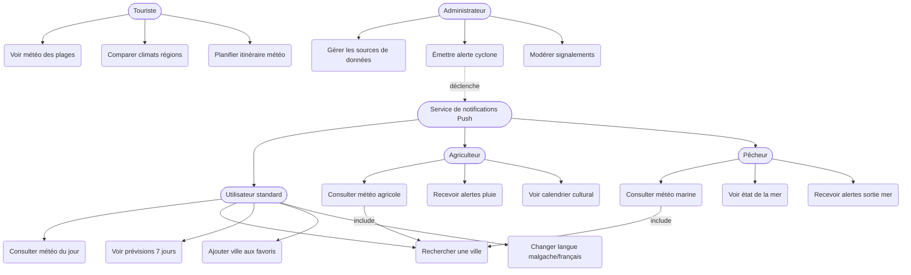
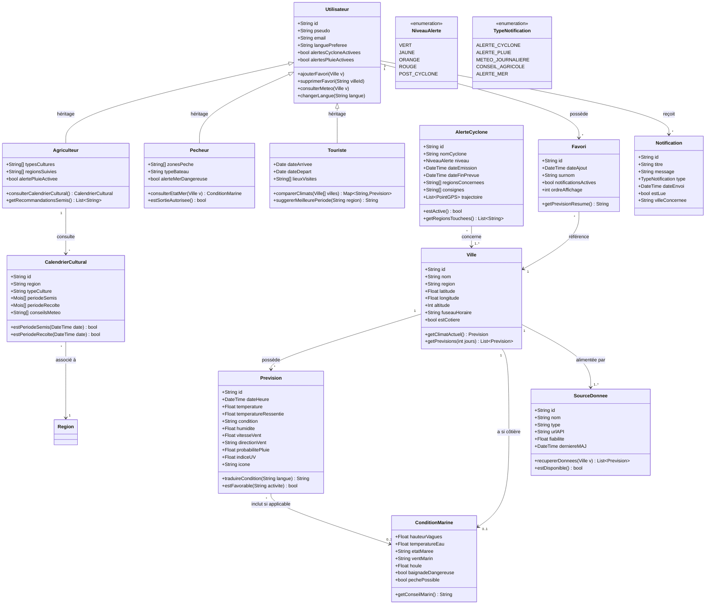
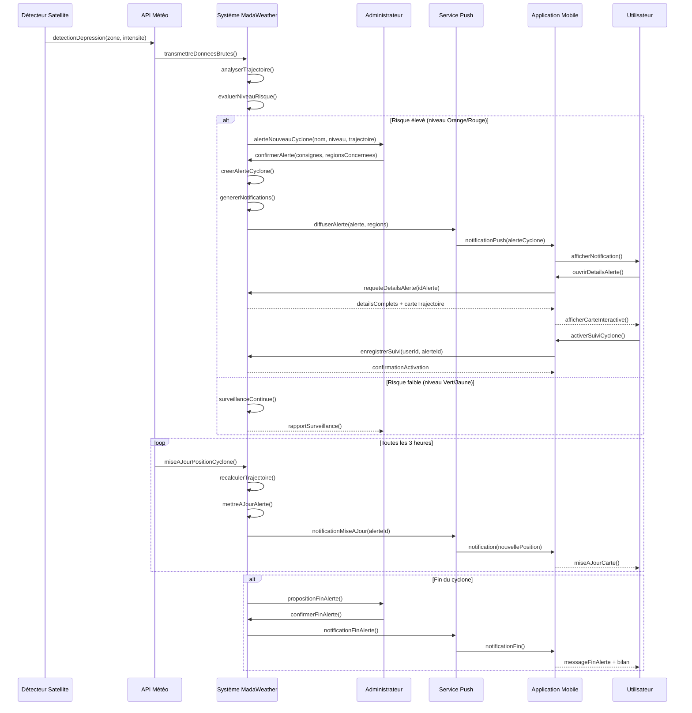
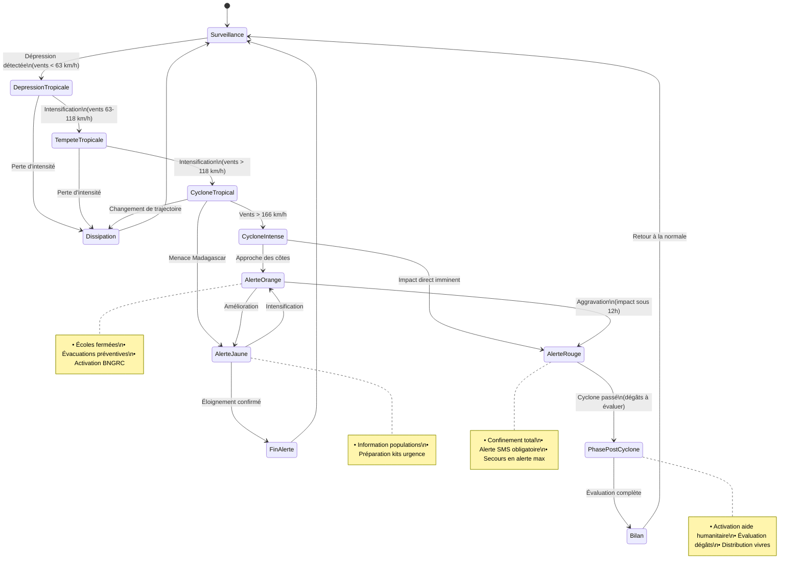
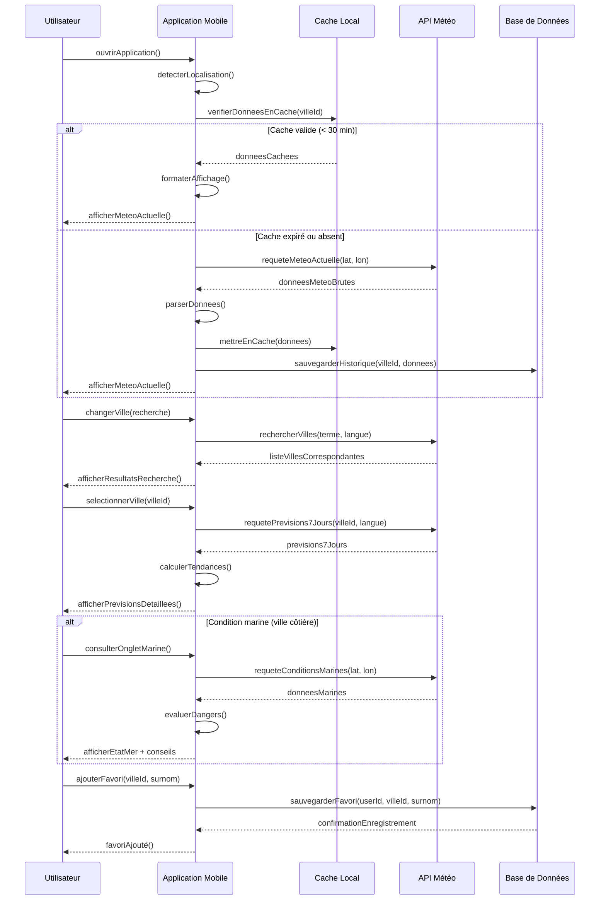

# MeteoMada

MeteoMada est une application mobile de météo pour Madagascar, développée avec **Flutter**.

## À propos du projet

Ce projet est une application mobile multiplateforme conçue pour fournir des informations météorologiques actualisées pour Madagascar. L'application est en cours de développement et sera déployée sur les plateformes Android, iOS, Web, Windows, Linux et macOS.

## Caractéristiques

- 📱 Application mobile multiplateforme avec Flutter
- 🌦️ Informations météorologiques en temps réel
- 🗺️ Couverture complète de Madagascar (23 régions)
- 🌡️ Données sur la température, l'humidité, le vent et bien plus
- ⚠️ Alertes cyclones en temps réel
- 🌾 Module météo agricole (riziculture, vanille, etc.)
- 🎣 Module météo marine pour les pêcheurs
- 🏖️ Recommandations touristiques par région
- 🇲🇬 Support bilingue Malgache / Français

## Technologies utilisées

- **Flutter** - Framework pour le développement multiplateforme
- **Dart** - Langage de programmation
- **Mermaid** - Diagrammes de conception UML
- Plateforme cible : Android, iOS, Web, Windows, Linux, macOS

## Démarrage

Pour contribuer ou développer cette application, consultez la [documentation officielle Flutter](https://docs.flutter.dev/).

## Conception UML

### 1. Diagramme de Cas d'Utilisation

### 2. Diagramme de Classes

### 3. Diagramme de Séquence : Alerte Cyclone

### 4. Diagramme d'États : Cycle de vie d'une Alerte Cyclone

### 5. Diagramme de Séquence : Consultation Météo Quotidienne

