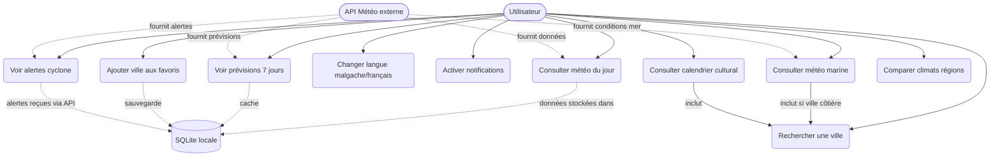
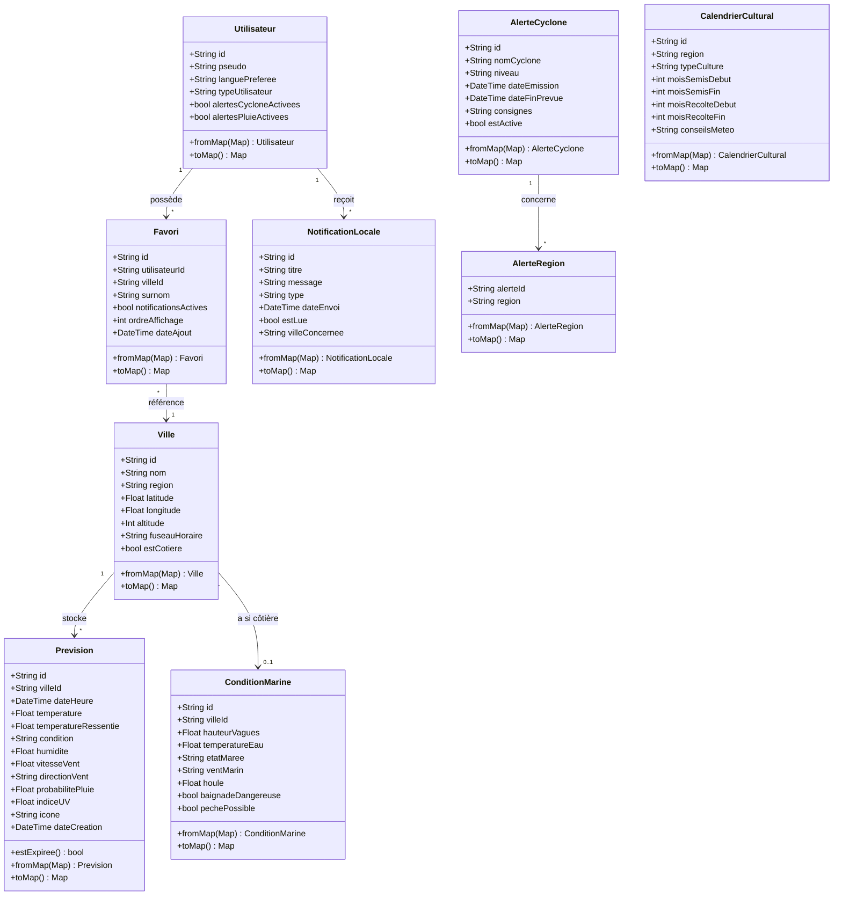
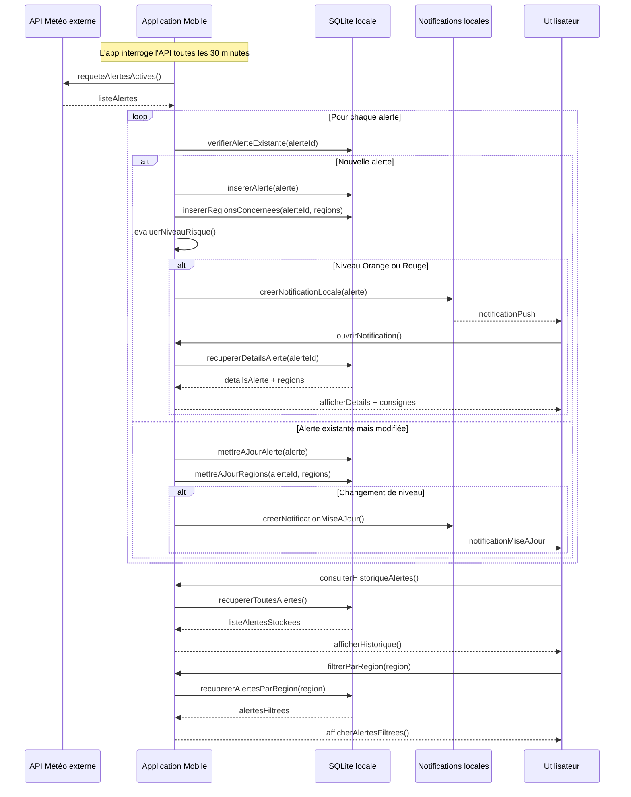
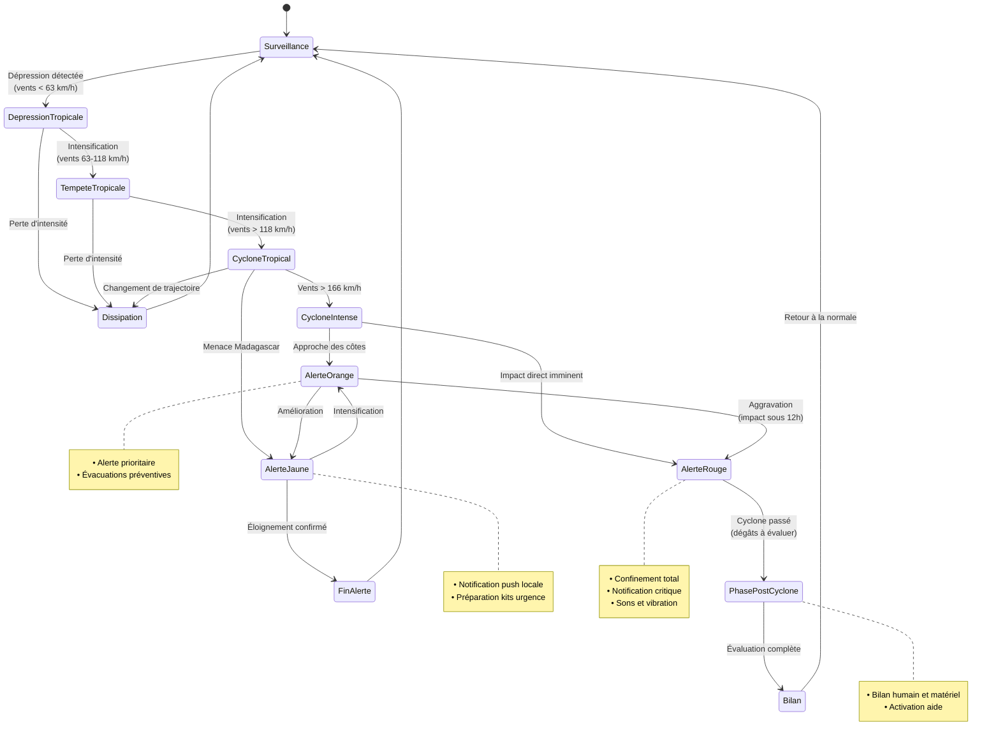
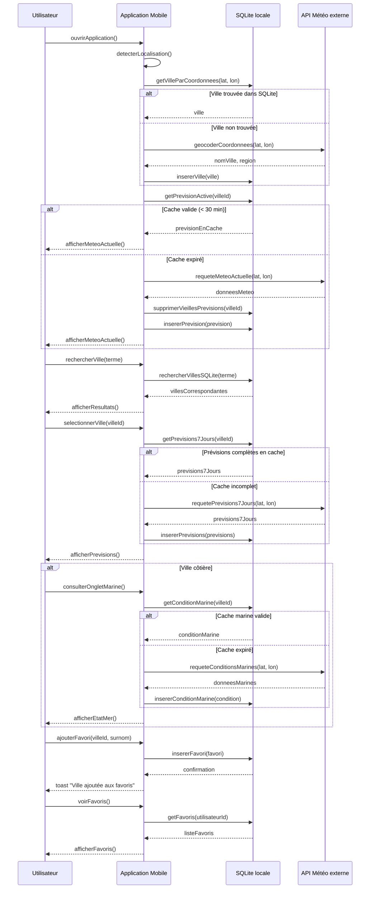

# MeteoMada

MeteoMada est une application mobile météo pour Madagascar, développée avec **Flutter**.

## À propos du projet

Application mobile multiplateforme qui fournit des informations météorologiques pour Madagascar. L'application fonctionne sans serveur back-end : les données météo sont récupérées directement depuis une API externe et stockées localement dans une base SQLite.

## Fonctionnalités

- 🌦️ Météo actuelle et prévisions 7 jours
- 🗺️ Couverture des 23 régions de Madagascar
- 🌡️ Température, humidité, vent, indice UV
- ⚠️ Alertes cyclones avec notifications locales
- 🌾 Calendrier cultural par région
- 🎣 Conditions marines pour les villes côtières
- 🏖️ Comparaison de climats entre régions
- ⭐ Villes favorites
- 🇲🇬 Bilingue malgache / français
- 📦 Stockage local SQLite

## Technologies

- **Flutter** - Framework multiplateforme
- **Dart** - Langage de programmation
- **SQLite** - Base de données locale
- **Mermaid** - Diagrammes UML

## Conception UML

### 1. Diagramme de Cas d'Utilisation

### 2. Diagramme de Classes

### 3. Diagramme de Séquence : Alerte Cyclone

### 4. Diagramme d'États : Cycle de vie d'une Alerte Cyclone

### 5. Diagramme de Séquence : Consultation Météo Quotidienne

