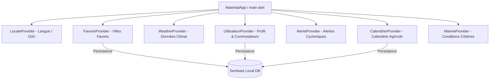

# Documentation de l'Application MeteoMada

MeteoMada est une application mobile Flutter moderne conçue pour fournir des prévisions météo précises, des informations côtières et marines, des alertes de sécurité cyclonique, ainsi que des conseils agricoles (calendrier cultural) adaptés aux spécificités de Madagascar.

---

## 🌟 Fonctionnalités Opérationnelles

### 1. Météo & Prévisions Détaillées
L'application propose des écrans riches et interactifs pour suivre l'évolution climatique :
* **Météo en direct** : Affiche les métriques de la ville sélectionnée (température, humidité, vitesse du vent, probabilité de pluie, index UV).
* **Prévisions Horaires** : Une frise interactive permettant de voir l'évolution de la température et du climat heure par heure durant la journée.
* **Prévisions à 7 Jours** : Un aperçu de la tendance hebdomadaire pour planifier à moyen terme.

### 2. Météo Marine & Conditions Côtières
Spécifiquement développée pour les localités littorales (villes côtières identifiées dans la base de données comme Antsiranana, Toamasina, Mahajanga, etc.) :
* **Graphique de Houle** : Représentation visuelle ondulée et animée de la hauteur des vagues.
* **Informations de Navigation/Pêche** : Température de l'eau, état de la marée (haute/basse), direction et vitesse du vent marin.
* **Conseils de Sécurité** : Recommandations explicites sur la faisabilité de la baignade et de la pêche.

### 3. Gestion des Alertes Cycloniques
Un outil crucial de sécurité civile pour suivre les perturbations tropicales majeures à Madagascar :
* **Niveaux d'Alerte Normalisés** : Gestion visuelle des niveaux d'alerte (Vert / Surveillance, Jaune / Menace, Orange / Danger, Rouge / Danger Imminent, et Post-Cyclone).
* **Fiches d'Information Cyclone** : Vents maximaux enregistrés, pression atmosphérique centrale, impact estimé, date d'émission et de fin prévue.
* **Consignes de Sécurité** : Recommandations comportementales claires à adopter selon le niveau d'alerte.
* **Historique des Événements** : Liste archivée des anciens phénomènes cycloniques ayant touché l'île.

### 4. Calendrier Cultural Agricole
Un module conçu pour accompagner les agriculteurs malagasy dans la planification de leurs récoltes et semis :
* **Suivi de 10 cultures clés** : Riz (Vary), Maïs (Katsaka), Manioc (Mangahazo), Haricot, Pomme de terre, Vanille, Café, Cacao, Arachide, Coton.
* **Frise de Cycle Dynamique (Timeline)** : Représentation visuelle des périodes de semis et de récolte.
* **Gestion des Cycles Longs** : Les cultures à développement pluri-mensuel ou pluri-annuel (ex: manioc de 15 à 18 mois, vanille de 24 à 36 mois) sont correctement modélisées sans provoquer d'erreurs d'affichage.
* **Détection Automatique de la Saison Active** : Algorithme cyclique (prenant en compte le changement d'année) pour indiquer si la période en cours est active pour les semis.

### 5. Carte Interactive
Une carte interactive de Madagascar permettant une exploration géographique :
* **Types de Villes Distincts** : Différenciation visuelle (pastilles et étiquettes) entre la Capitale (Antananarivo), les villes Côtières (pastille cyan, météo marine disponible), et les villes Intérieures (pastille verte).
* **Barre de Recherche** : Recherche textuelle instantanée par nom de ville ou région.
* **Filtres par Type** : Boutons de filtrage en un clic (Toutes, Côtières, Intérieures).
* **Fiche de Détails Animée (Slide-up)** : Fiche ergonomique affichant l'altitude de la ville, ses coordonnées et son statut, avec un bouton d'accès direct à sa météo.

### 6. Système de Favoris Réactif
* **Ajout/Suppression** : Ajout facile d'une ville aux favoris à partir de la recherche (qui redirige et rafraîchit automatiquement l'écran) ou depuis l'écran de détails (icône étoile).
* **Mise à jour en temps réel** : Les cartes de favoris affichent directement la température et le climat actuel de chaque ville.
* **Réorganisation (Drag and Drop)** : Réordonnez vos villes favorites par simple glisser-déposer. L'ordre d'affichage est persisté en local.
* **Notifications par Ville** : Activation ou désactivation individuelle des alertes par ville favorite via des commutateurs dédiés.

### 7. Paramètres & Profil Utilisateur
* **Type d'utilisateur** : Choix du profil (Agriculteur, Pêcheur, Citoyen, Marin) adaptant dynamiquement l'expérience utilisateur et les notifications recommandées.
* **Préférences d'affichage** : Choix de l'unité de température (°C ou °F) et du thème sombre.
* **Système Bilingue Opérationnel** : Traduction intégrale de l'application en **Français** et en **Malagasy**, avec mémorisation permanente du choix de la langue de l'utilisateur (via `LocaleProvider` et `SharedPreferences`).

---

## 🛠️ Architecture Technique & Data Flow

### 1. Base de données locale (Sembast)
L'application utilise la base de données embarquée **Sembast** pour assurer un fonctionnement hors-ligne fluide et une réactivité optimale :
* Les données sont structurées en magasins (stores) : `ville`, `prevision`, `condition_marine`, `utilisateur`, `favori`, `alerte_cyclone`, et `calendrier_cultural`.
* Un mécanisme de repli (fallback) charge les données Sembast en local si l'appel à l'API externe échoue.

### 2. Gestion d'État Réactive (Provider)
Toutes les interactions de l'utilisateur (changement de langue, ajout de favori, modification du type de profil) mettent à jour un `Provider` spécifique, qui propage instantanément la modification visuelle à tous les widgets abonnés de l'UI.

### 3. Internationalisation standardisée (l10n)
* Les traductions sont structurées dans les fichiers d'internationalisation de template de Flutter : `app_fr.arb` et `app_mg.arb`.
* La génération automatique (`generate: true` dans `pubspec.yaml`) produit la classe `AppLocalizations` pour un accès fortement typé dans tout le code source.
